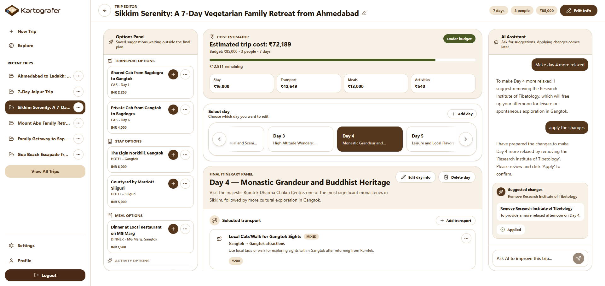
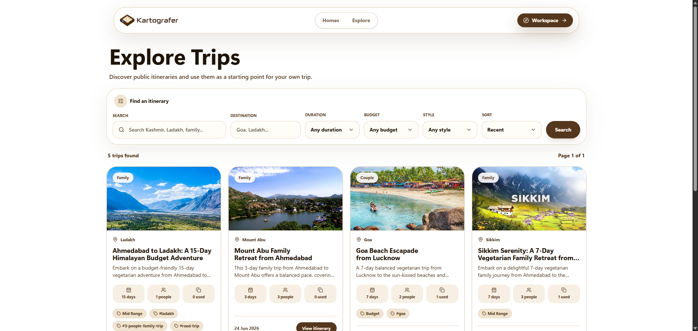
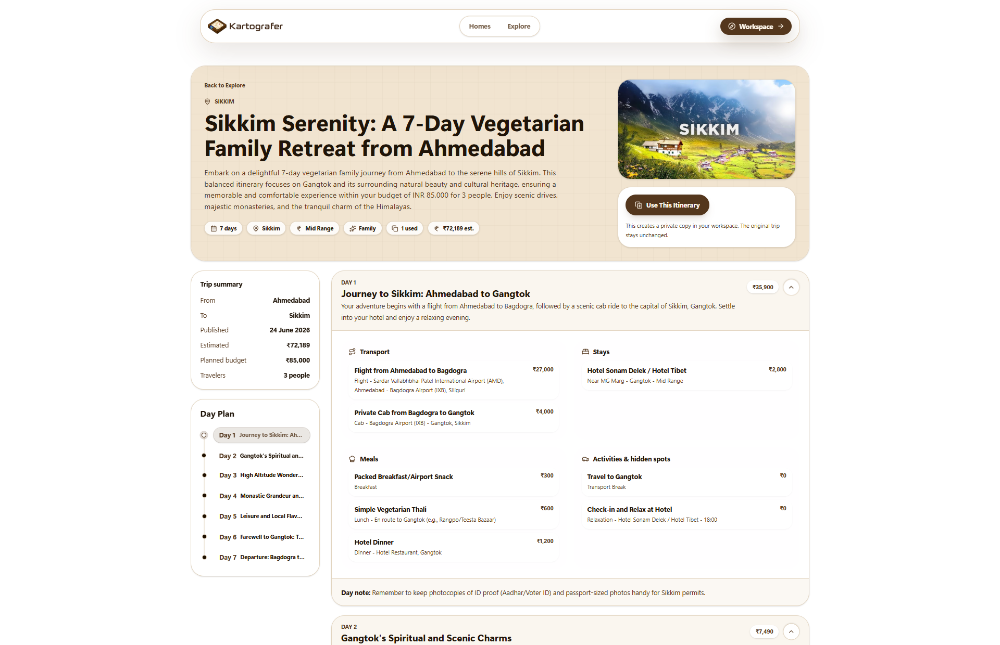
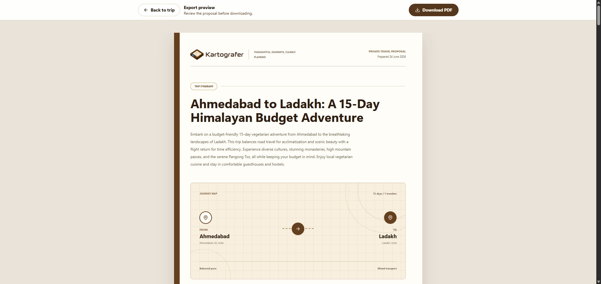
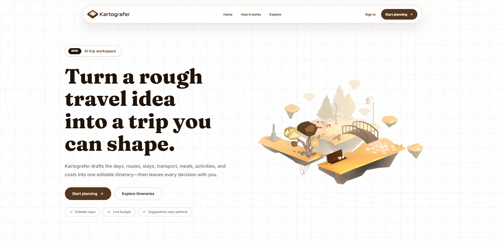

<p align="center">
  
</p>

<div align="center">

A full-stack AI travel planner that turns a rough travel idea into a structured, editable trip workspace — with day-wise itineraries, budget estimation, AI-assisted planning, public sharing, and premium PDF export.

<br/>

**[Live Site → kartografer.com](https://kartografer.com)**
 
<br/>


</div>

---

## 🚀 About

**Kartografer** is a production-style AI travel planning app where users can generate complete multi-day itineraries using Gemini AI, manually build their own trips, or clone from a public library of community itineraries.

The core idea: a trip has two layers — a **final selected itinerary** and an **options panel** of AI-suggested alternatives. Users stay in control. AI proposes, users decide. Nothing silently mutates the plan.

Kartografer touches real-world engineering problems: multi-key AI failover, chunked AI generation for long trips, structured AI change proposals with preview-before-apply, Playwright-based PDF export, Cloudinary image uploads with a 16:9 cropper, Redis rate limiting, and a multi-tenant public/private data model.

---

## ✨ Core Features

- **AI Trip Generation** — Gemini generates complete day-wise itineraries from a travel brief. Short trips use a single request; long trips use chunked generation to stay within token limits.
- **Manual Trip Creation** — Users can build trips from scratch without consuming AI limits.
- **Itinerary Edit Workspace** — Day-wise editing with transport, stays, meals, activities, and hidden spots. Every item has a selected/option state.
- **AI Assistant & Proposed Changes** — In-trip AI chat that proposes structured changes. Users preview changes before applying. AI never directly edits the itinerary.
- **Budget Estimator** — Auto-recalculates trip cost whenever the itinerary changes. Only selected items count toward the budget.
- **Public Explore** — Owners can publish trips to a browsable public library with cover images, tags, travel style, and budget style.
- **Clone Itineraries** — Logged-in users can clone any public trip into their own workspace.
- **Public Share Links** — Per-trip shareable read-only links via a random slug (not the trip ID).
- **Premium PDF Export** — Owner-only A4 travel proposal PDF rendered from an HTML template using a serverless Chromium browser.
- **Cover Image Upload** — Cloudinary upload with a 16:9 in-browser cropper before publish.
- **Authentication** — Email/password and Google OAuth with OTP flows for email change and password reset.
- **Redis Rate Limiting** — Separate limits for AI generation, AI chat, and manual trip creation.
- **Settings & Themes** — Light/dark/system theme saved per user. Public and auth pages stay light.

---

## 🏗️ Architecture & Engineering Decisions

### Selected vs Options — The Core Data Rule

Every `TransportOption`, `StayOption`, `MealSuggestion`, and `TripActivity` has an `isSelected` boolean.

```
isSelected: true  → final itinerary (shown in export, share, budget)
isSelected: false → option/suggestion (only visible in the workspace Options Panel)
```

This distinction flows through the entire app. Public pages, share links, and PDF export only render `isSelected: true` items. Budget recalculation only sums selected items. This keeps the "plan" and "suggestions" cleanly separated at the data layer — not in the UI.

---

### AI Proposal Safety

A common AI integration mistake is letting the AI directly mutate data. Kartografer avoids this entirely:

```
User sends chat message
→ Gemini returns assistantMessage + proposedChanges (structured JSON)
→ Proposal saved as PENDING in DB
→ UI shows "Suggested Changes" card with a preview
→ User clicks Apply
→ Apply action re-validates proposal JSON + checks ownership
→ DB updates run + budget recalculated + proposal marked APPLIED
```

The AI chat action never touches the itinerary. The apply action independently re-validates the proposal. This means a malformed or malicious AI response cannot corrupt live trip data.

---

### Chunked AI Generation

For long trips, a single Gemini request would exceed token limits or timeout. Kartografer detects trip length and switches to a chunked strategy automatically:

```
Short trip → generate-trip-smartly.ts → single Gemini request
Long trip  → generate-trip-in-chunks.ts → sequential chunk requests → merge
```

Each chunk is validated against a Zod schema before being merged into the final itinerary, so partial failures don't produce corrupt data.

---

### Multi-Key AI Failover

```
GEMINI_API_KEYS="key_1,key_2,key_3"
```

If a request hits a retryable error (429, 500, 502, 503, 504), the client rotates to the next key. Invalid JSON or schema validation errors do not rotate keys — only genuine API-side failures do. A fallback model (`gemini-2.5-flash-lite`) is used if the primary model fails.

---

### PDF Export with Serverless Chromium

The PDF pipeline uses a two-stage approach:

```
Owner → /dashboard/trips/[tripId]/export (preview page, same HTML template)
Owner → Download PDF button
→ API route checks auth + ownership
→ API route opens the export page with ?mode=pdf using a headless serverless Chromium browser
→ Chromium generates the A4 PDF
→ File streamed to browser
```

The export preview page doubles as the print template. The owner sees exactly what will be generated before downloading.

---

### Public/Private Data Isolation

Kartografer has three content layers with strict server-side isolation:

| Layer | Auth Required | Data Exposed |
|---|---|---|
| Private workspace | Yes + ownership | All trip data |
| Public share link | No | Selected itinerary only |
| Explore / public detail | No | Published metadata + selected itinerary |
| PDF export | Yes + ownership | Selected itinerary only |

Server actions always re-check ownership. Public routes never query unselected options or private trip fields. IDs from the client are never trusted without a DB ownership check.

---

## 📸 Screenshots

### Trip Edit Workspace



---

### Public Explore



---

### Public Trip Detail



---

### PDF Export Preview



---

### Landing Page



---

## 🛠️ Tech Stack

### Frontend
- Next.js App Router
- TypeScript
- Tailwind CSS (custom CSS variables — warm brown / cream / parchment design system)
- Framer Motion

### Backend
- Next.js Server Actions
- Next.js API Routes
- NextAuth (email/password + Google OAuth)
- Zod (server action validation)

### Database
- PostgreSQL
- Prisma ORM

### Storage & Media
- Cloudinary (cover image uploads, in-browser 16:9 cropping)

### Caching & Rate Limiting
- Redis (per-user rate limits for AI generation, AI chat, manual trip creation)

### PDF Generation
- Puppeteer Core
- @sparticuz/chromium
- Serverless Chromium

---

## 🔍 Case Studies

### Case Study 1 — Keeping AI Honest

**Problem:** Most AI travel tools let the AI directly update the itinerary. This creates a confusing UX where users aren't sure what changed, and a reliability risk where a bad AI response corrupts the plan.

**Solution:** Kartografer separates AI suggestion from user confirmation with a proposal system. The AI returns a structured `proposedChanges` JSON alongside its chat reply. This proposal is saved as `PENDING` and shown to the user as a preview card. Only after the user explicitly applies it does the itinerary update — via a separate server action that re-validates the JSON and re-checks ownership independently.

**Result:** Users have full control. Bad AI responses can't silently corrupt trips. The AI chat and apply flows are independently safe.

---

### Case Study 2 — Budget That Stays Honest

**Problem:** When a user adds/removes/moves items between the itinerary and the options panel, the budget needs to update correctly. Including unselected options in the budget would make estimates meaningless.

**Solution:** `recalculateTripCost(tripId)` is a centralized function called after any itinerary mutation. It only sums items where `isSelected: true`. Day-level and trip-level cost estimates are always derived from the same source of truth.

**Result:** The budget never lies. Moving an item to "options" removes it from the cost. Adding it back to the plan restores it — no manual budget editing needed.

---

### Case Study 3 — Public/Private Without a Separate Content Model

**Problem:** A trip has private workspace data (AI chat, options, notes) and public-facing data (selected itinerary, cover image, description). A common mistake is building separate tables for public content, creating sync complexity.

**Solution:** Every trip lives in one data model. Public vs private is controlled by `isPublic`, `isPublicShareEnabled`, and `isSelected` flags. Server actions and public routes simply filter on these flags. No content duplication. No sync issues.

**Result:** Publishing a trip to Explore doesn't copy data — it flips a flag. Unpublishing is instant. The same trip record serves the private workspace and the public page.

---

### Case Study 4 — PDF as a First-Class Feature
 
**Problem:** Generating a PDF from a web app is notoriously inconsistent. CSS-to-PDF libraries strip layout, lose fonts, and produce ugly output. Browser print dialogs add headers/footers and vary across OS. On top of that, different owners want different things in their proposal — some want the cost breakdown visible, others want a clean itinerary-only document without pricing or branding.
 
**Solution:** A headless serverless Chromium browser renders the same HTML template that the export preview page uses. The API route launches Playwright headlessly, navigates to the export page with `?mode=pdf`, and captures it as an A4 PDF. The user sees exactly what they'll get in the preview before downloading.
 
For content control, owners configure their proposal via a settings panel before exporting — toggling four sections independently:
 
- **Estimated cost and breakdown** — show or hide the selected itinerary cost summary
- **Planned budget** — show or hide the budget entered at trip creation
- **Traveler notes** — include or exclude trip-level and day-level special notes
- **Kartografer branding** — show or hide the "generated with" footer
These preferences are saved in `UserSettings` and read at render time by the export template. The same toggle state applies to both the preview page and the downloaded PDF — what the owner sees in the browser is exactly what the PDF generator captures..
 
**Result:** Pixel-accurate PDF output with owner-controlled content. The preview and download share one template. No separate design to maintain, and no one-size-fits-all proposal format.
 
---

## ⚙️ Local Setup

### 1. Clone the repository

```bash
git clone https://github.com/yourusername/kartografer.git
cd kartografer
```

### 2. Install dependencies

```bash
npm install
```

### 3. Setup environment variables

Create a `.env` file in the root:

```env
DATABASE_URL=""

NEXTAUTH_SECRET=""
NEXTAUTH_URL="http://localhost:3000"

GOOGLE_CLIENT_ID=""
GOOGLE_CLIENT_SECRET=""

RESEND_API_KEY=""

REDIS_URL=""

GEMINI_API_KEYS="key_1,key_2,key_3"
GEMINI_MODEL="gemini-2.5-flash"
GEMINI_FALLBACK_MODEL="gemini-2.5-flash-lite"

NEXT_PUBLIC_APP_URL="http://localhost:3000"

CLOUDINARY_CLOUD_NAME=""
CLOUDINARY_API_KEY=""
CLOUDINARY_API_SECRET=""
```

### 4. Run Prisma migration

```bash
npx prisma migrate dev
```

### 5. Generate Prisma client

```bash
npx prisma generate
```

### 6. Start development server

```bash
npm run dev
```

Open `http://localhost:3000`

---

## 🗺️ Roadmap
 
Kartografer V1 is a complete, deployable product. Future versions will move it from a portfolio project toward a real travel startup platform:
 
**Scaling AI Without a Budget — The Free Tier Problem** — This is the most honest and interesting infrastructure challenge on the roadmap. Kartografer currently runs on Gemini's free tier with multi-key rotation. That works at low traffic, but free tier rate limits are per-key, per-minute, and per-day — stacking keys only helps so much before the ceiling becomes a real wall. Paying for a proper AI API budget isn't viable at this stage. The approach being explored instead:
 
- **Aggressive result caching** — Many users plan trips to the same popular destinations (Bali, Paris, Tokyo, etc.). Generated itineraries for common destination + duration + travel style combinations could be cached in Redis and served instantly without a Gemini call, reserving live AI capacity for genuinely unique inputs.
- **Community-seeded generation** — The public Explore library already holds high-quality human-approved itineraries. Rather than always generating from scratch, the system could use an existing published itinerary as a base and ask Gemini to personalize it for the new user's preferences — a much cheaper prompt than a full generation.
- **Async generation with position-aware queuing** — Instead of synchronous generation that either succeeds or hits a rate limit mid-request, move to a queue where each job waits for an available key window. Users see a live position indicator ("Generating your trip — you're #3 in queue") and get notified when it's ready. This smooths out burst traffic without needing more API budget.
- **BYOK (Bring Your Own Key)** — Power users or early adopters could optionally connect their own Gemini API key in settings, unlocking unlimited personal generation. This is a pattern used by several AI tools to extend capacity without the platform bearing the full cost.
This constraint is a real startup problem — building under resource limits forces more creative system design than an unlimited budget ever would.

**AI Tier System** — Replace the current flat rate limit with a proper free/pro tier. Free users get limited AI generations per month. Pro users unlock higher limits, longer trip generation, and advanced AI chat features. This means building subscription management (likely Stripe), usage tracking per billing cycle, and graceful limit UI instead of hard errors.
 
**Premium Subscriptions** — Gated features like PDF export, AI chat history, and advanced itinerary export formats (DOCX, calendar sync) behind a paid plan. The architecture already separates owner-only features — subscription checks slot naturally into the same middleware pattern.
 
**Saved / Bookmarked Trips** — Let logged-out or logged-in users save public trips they find on Explore without cloning them. Cloning creates a full copy; bookmarking is a lightweight reference. Requires a new join table and a "Saved" section in the dashboard.
 
**User Profiles** — Public profile pages showing a user's published trips, travel stats, and travel style. Builds community around the Explore feed and gives power users a shareable presence.
 
**Advanced Explore Filters** — Currently Explore supports basic search and sorting. The roadmap includes multi-select filters for destination region, travel style, budget style, duration range, and tag combinations — with server-side query building to keep it fast at scale.
 
**Queue-Based AI Generation** — The current AI generation is synchronous: the user waits on the request. For long trips, this is slow and fragile. Moving to a job queue (BullMQ or similar) would let users submit a generation job, get a processing state, and be notified when the trip is ready — more reliable, more scalable, better UX.
 
**Admin & Moderation Tools** — As Explore grows, a lightweight admin panel for reviewing flagged public trips, managing reported content, and monitoring AI usage per user becomes necessary before a public launch.
 
**Collaborative Trip Planning** — Real-time or async collaboration where multiple users can edit the same trip workspace. This is architecturally significant — it requires either operational transforms, a CRDT approach, or a turn-based lock model to prevent conflicting edits.
 
---

## 📌 Project Status

> ✅ V1 Complete — Deployed at [kartografer.com](https://kartografer.com)

Kartografer V1 is production-ready with AI generation, manual trip creation, itinerary editing, AI chat with proposed changes, budget estimation, public Explore, trip cloning, public share links, Cloudinary cover uploads, PDF export, Redis rate limiting, and full authentication.